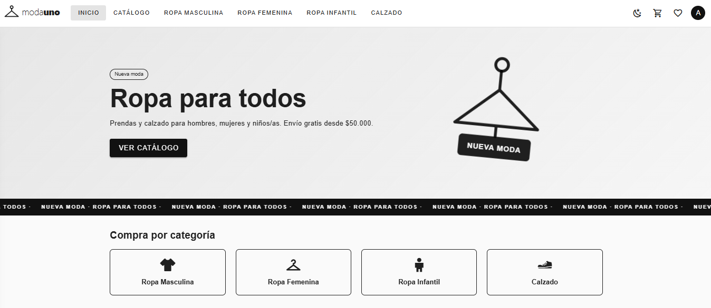
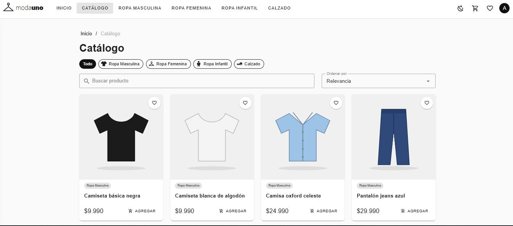
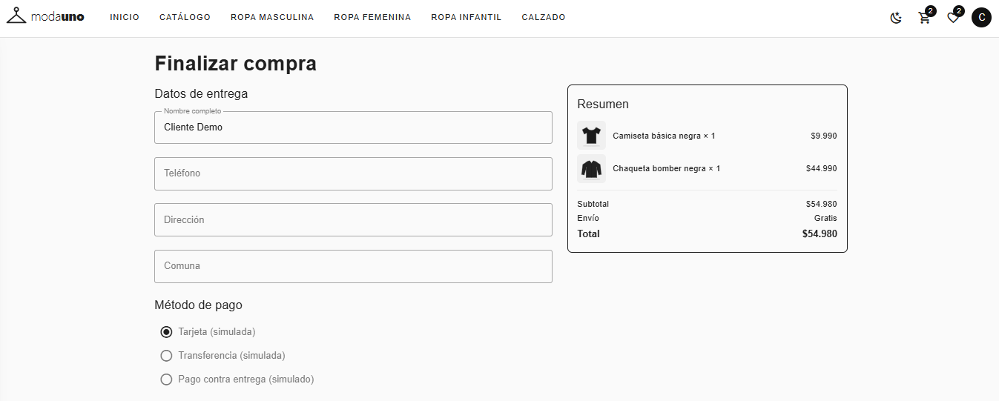
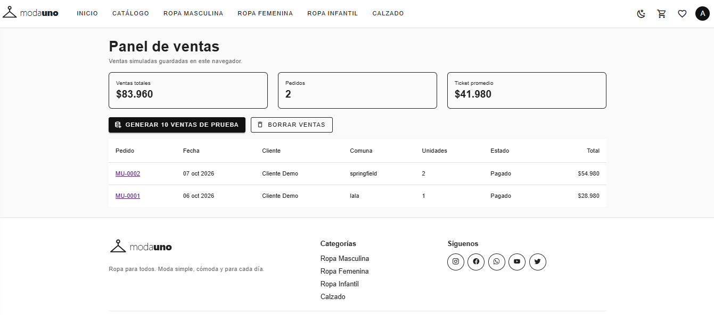
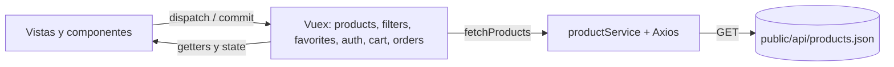

# 🧥 ModaUno · Ropa para todos

Tienda online (SPA) de ropa y calzado hecha con **Vue 3, Vue CLI, Vuex, Axios y Vuetify**.
Proyecto de evaluación del **Módulo 7: Desarrollo de aplicaciones front-end con framework Vue** (Alkemy).


🔗 **Demo en línea:** 

<!-- Agrega tus capturas en docs/screenshots/ con estos nombres (o cambia las rutas) -->
| Inicio | Catálogo |
| --- | --- |
|  |  |

| Carrito | Panel de ventas |
| --- | --- |
|  |  |

## Contenido

- [Funcionalidades](#funcionalidades)
- [Tecnologías](#tecnologías)
- [Instalación](#instalación)
- [Cuentas de prueba](#cuentas-de-prueba)
- [Scripts](#scripts)
- [Rutas](#rutas)
- [Arquitectura y estructura](#arquitectura-y-estructura)
- [API y datos](#api-y-datos)
- [Pruebas](#pruebas)
- [Despliegue en GitHub Pages](#despliegue-en-github-pages)
- [Decisiones técnicas](#decisiones-técnicas)
- [Limitaciones y mejoras futuras](#limitaciones-y-mejoras-futuras)
- [Autor](#autor)

## Funcionalidades

- **Catálogo** de 30 productos en 4 categorías: Ropa Masculina, Ropa Femenina, Ropa Infantil y Calzado.
- **Filtros y subrutas:** por categoría y por tipo de prenda (`/catalogo/ropa-infantil/vestidos`), búsqueda por nombre y orden por precio.
- **Detalle de producto** con cantidad, "Agregar al carrito" y "Comprar ahora".
- **Cuentas simuladas:** registro e ingreso desde un modal, con cuentas de prueba de un clic.
- **Favoritos** por usuario (solo con sesión iniciada).
- **Carrito** con cantidades, subtotal, envío ($3.990, gratis desde $50.000) y total en pesos chilenos.
- **Checkout con pago simulado**, con opción de simular un pago rechazado, confirmación del pedido e historial en "Mis compras".
- **Panel de ventas** para el administrador, con indicadores y generación de ventas ficticias para pruebas.
- **Diseño responsive**, menú hamburguesa en pantallas pequeñas y **tema claro/oscuro**.
- Estados de **carga, error y vacío** en el catálogo.

## Tecnologías

| Tecnología | Uso |
| --- | --- |
| Vue 3 + Vue CLI 5 | Base de la aplicación (Vite no se usa, por requisito del curso) |
| Vue Router 4 | Rutas de la SPA y protección de páginas privadas |
| Vuex 4 | Estado global con módulos: `products`, `filters`, `favorites`, `auth`, `cart`, `orders` |
| Axios | Consumo de la API REST |
| Vuetify 3 | Componentes de interfaz, grilla responsive y temas |
| ESLint | Calidad de código (`no-var`, `prefer-const`, `eqeqeq`) |
| Jest + Vue Test Utils | Pruebas unitarias |
| Cypress | Pruebas end-to-end |

Todas las dependencias están fijadas en versiones exactas, con `package-lock.json`.

## Instalación

**Requisitos:** [Node.js 20 LTS](https://nodejs.org) (probado con Node 18 a 22), npm y Git.

```bash
git clone https://github.com/niino777/ecommerce-testing-suite.git
cd modauno
npm install
npm run serve
```

La aplicación queda en `http://localhost:8080`.

## Cuentas de prueba

El modal de ingreso tiene botones que entran con un clic:

| Rol | Correo | Contraseña |
| --- | --- | --- |
| Cliente | `cliente@modauno.cl` | `Demo1234` |
| Administrador | `admin@modauno.cl` | `Admin1234` |

El administrador ve **Panel de ventas** en el menú de la cuenta y puede generar o borrar ventas ficticias.

## Scripts

| Comando | Qué hace |
| --- | --- |
| `npm run serve` | Servidor de desarrollo |
| `npm run build` | Build de producción en `/dist` |
| `npm run lint` | Revisa el código con ESLint |
| `npm run test:unit` | Pruebas unitarias (Jest) |
| `npm run cy:install` | Descarga el programa de Cypress a `.cypress-cache` (una sola vez) |
| `npm run cy:verify` | Comprueba que Cypress quedó bien instalado |
| `npm run cy:doctor` | Diagnóstico si Cypress falla |
| `npm run test:e2e:run` | Todas las pruebas E2E en consola (con la app abierta) |
| `npm run test:e2e:index` | Solo las E2E del login |
| `npm run test:e2e:catalog` | Solo las E2E del catálogo |
| `npm run test:e2e:purchase` | Solo las E2E de la compra |
| `npm run e2e` | Levanta la app, ejecuta las E2E y la apaga |
| `npm run test:e2e` | Cypress con interfaz gráfica (opcional) |

## Rutas

| Ruta | Página | Acceso |
| --- | --- | --- |
| `/` | Inicio | Público |
| `/catalogo`, `/catalogo/:categoria`, `/catalogo/:categoria/:tipo` | Catálogo y subrutas | Público |
| `/producto/:id` | Detalle de producto | Público |
| `/favoritos` | Favoritos | Con sesión |
| `/checkout` | Datos de entrega y pago simulado | Con sesión |
| `/pedido/:id` | Confirmación del pedido | Con sesión |
| `/mis-compras` | Historial de compras | Con sesión |
| `/admin/ventas` | Panel de ventas | Administrador |

## Arquitectura y estructura



```
public/
  api/products.json     API REST simulada (30 productos, 4 categorías)
  img/products/         Ilustraciones SVG de los productos
src/
  components/           AppHeader, AppFooter, AppLogo, AuthDialog, CartDrawer,
                        OrderSummary, ProductCard, ProductList
  views/                Home, Catalog, ProductDetail, Favorites, Checkout,
                        Order, Orders, AdminSales
  store/                Vuex: products, filters, favorites, auth, cart, orders
  services/             api.js (Axios) y productService.js
  router/               Rutas y protección de páginas privadas
  utils/                Categorías, formato CLP, datos demo, hash
tests/unit/             Pruebas unitarias (Jest)
cypress/e2e/            Pruebas E2E: index, catalog y purchase
cypress/screenshots/    Capturas de las pruebas (evidencias)
scripts/cypress.js      Ejecuta Cypress con el programa dentro del proyecto
docs/                   Guía de pruebas y capturas del README
```

Los componentes reciben datos por *props* y avisan por eventos; la lógica de datos vive en Vuex, y los componentes se conectan con `mapState`, `mapGetters`, `mapActions` y `mapMutations`.

## API y datos

La aplicación consume una **API REST simulada**: el archivo `public/api/products.json`, que Axios pide como si fuera un servicio externo. Cada producto tiene esta forma:

```json
{
  "id": 25,
  "title": "Zapatillas urbanas blancas",
  "price": 39990,
  "section": "calzado",
  "type": "zapatillas",
  "typeLabel": "Zapatillas",
  "description": "Zapatillas cómodas y resistentes...",
  "image": "img/products/25-zapatillas-urbanas-blancas.svg",
  "isNew": true
}
```

Para agregar o cambiar productos basta con editar ese archivo. Las categorías válidas son `ropa-masculina`, `ropa-femenina`, `ropa-infantil` y `calzado`.

## Pruebas

Resumen: **11 pruebas unitarias** (5 archivos) y **15 pruebas E2E** (3 archivos).

### Unitarias (Jest + Vue Test Utils)

```bash
npm run test:unit
# o, con el detalle de cada prueba:
npx jest --verbose
```

| Archivo | Qué comprueba |
| --- | --- |
| `ProductCard.spec.js` | Render correcto de la tarjeta y eventos de favorito y agregar al carrito |
| `ProductList.spec.js` | Mensaje de error visible cuando la API falla |
| `cart.spec.js` | Suma de unidades, subtotal, envío, total y eliminación |
| `orders.spec.js` | Creación de pedidos, pago rechazado y numeración de ventas |
| `productService.spec.js` | Llamada al servicio y rutas de imágenes |

### End-to-end (Cypress)

Preparación (una sola vez):

```bash
npm install
npm run cy:install     # descarga Cypress (~200 MB) a .cypress-cache
npm run cy:verify      # debe terminar con "Verified Cypress!"
```

Ejecución (con la app abierta en otra terminal con `npm run serve`):

```bash
npm run test:e2e:run
```

o todo en un solo comando: `npm run e2e`.

| Archivo | Pruebas |
| --- | --- |
| `index.cy.js` | Iniciar sesión con la cuenta demo, error con clave incorrecta, cerrar sesión |
| `catalog.cy.js` | Mostrar productos, filtrar por categoría, filtrar por tipo (subruta), buscar, sin resultados, abrir detalle |
| `purchase.cy.js` | Agregar al carrito, cambiar cantidad y eliminar, pedir sesión, compra completa, pago rechazado, historial |

Las capturas quedan en `cypress/screenshots/` y los videos en `cypress/videos/`.


## Despliegue en GitHub Pages

El repositorio incluye el flujo `.github/workflows/deploy.yml`, que en cada `push` a `main` revisa el código, ejecuta las pruebas unitarias, construye el sitio y lo publica.

1. Sube el proyecto a GitHub (rama `main`).
2. En **Settings → Pages**, elige **Source: GitHub Actions**.
3. Haz un `push`; el sitio queda en `https://TU-USUARIO.github.io/NOMBRE-DEL-REPO/`.

En producción la app usa rutas con `#` (por ejemplo `/#/catalogo`) y rutas relativas, por lo que funciona en cualquier subcarpeta sin configuración extra. También puedes generar el sitio a mano con `npm run build` y publicar la carpeta `dist`.

## Decisiones técnicas

- **API propia en lugar de una pública.** Se evaluó Platzi Fake Store API, pero es editable por cualquiera (la categoría de ropa fue renombrada y trae datos de prueba), está en inglés y en dólares, y no tiene ropa infantil. El mock propio da un catálogo estable, en español y con las categorías pedidas.
- **Vuex con módulos namespaced:** cada módulo tiene una responsabilidad; la llamada a la API está en una acción y el filtrado en getters.
- **Compra simulada:** el pedido se crea con estado "Pagado" sin pasarela de pago ni datos de tarjeta. La casilla "Simular pago rechazado" permite probar el error.
- **Cuentas y ventas en el navegador:** no hay servidor, así que usuarios, favoritos, carrito y pedidos se guardan en `localStorage`. Las contraseñas se guardan como hash SHA-256.
- **Cypress dentro del proyecto:** el programa se instala en `.cypress-cache` para evitar problemas de rutas y permisos en Windows.
- **Nuxt o Quasar (opcional en la consigna):** no se migró. El proyecto es una SPA con Vue CLI, como exige el curso; Nuxt sería útil si se necesitara SEO, y Quasar para una versión móvil o de escritorio.

## Limitaciones y mejoras futuras

- Autenticación, roles y pagos son de demostración; en un sistema real los resuelve un backend.
- La API es un archivo estático: no permite crear ni editar productos desde la app.
- Mejoras posibles: backend real con autenticación y pagos, tallas y stock, más pruebas (panel de ventas y registro) y migración a Nuxt.


Proyecto con fines educativos, desarrollado para el Módulo 7 del programa de Alkemy.
